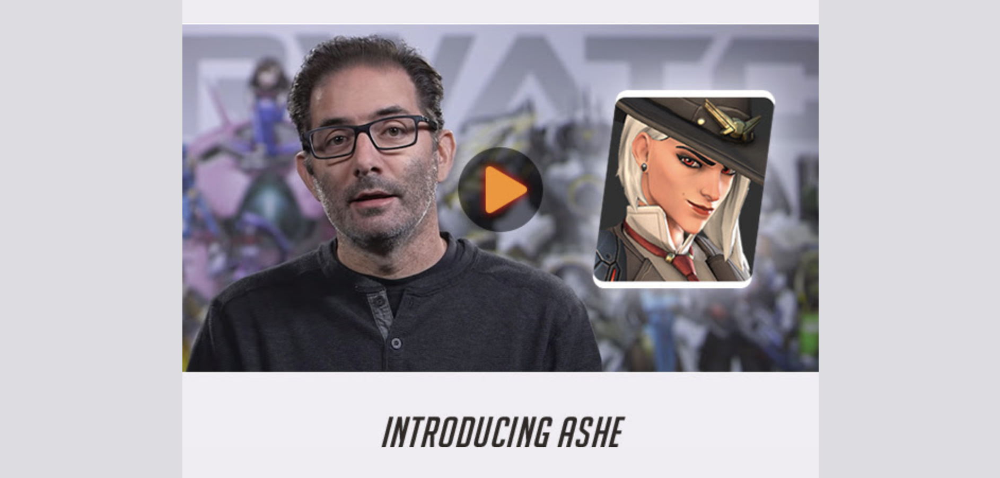

# EDM Build Tool

A blend of gulp tasks with the focus of making a developer's life easier when it comes to building an EDM template from scratch. This tool does not include any deployment to any CRM as the process after building your template has to be manually managed by the developer itself.

## Getting started

To begin, we will require the `gulp` CLI which we can acquire via npm

```
npm install -g gulp
```

**For development**

```
gulp
```

Will start a browser sync server to start watching your changes and reload the browser as changes are made.

**For production**

```
gulp build
```

Which will create a public folder with your HTML template(s) that have already been inlined

## Features

- SCSS with `autoprefixer` and `cleanCSS`
- Build HTML templates with `twig`
- Compiles image with `imagemin`
- BrowserSync
- Inlines style to production ready HTML templates
- List of `partials` to empower your development. More below.

## List of partials

Making use of Twig's ability to embed partials within a layout. This build tool provides a list of partial that can empower your development work for your EDM template. Here are a few that the tool includes out of the box.

1. Full bleed image

A good use case for a full bleeed image can be depicted in this Blizzard EDM on the release of a new hero, Ashe.



Here's how you can embed the partial into your template.

```

```


Walaa!

## Deployment to Production environment

Start off by building your production-ready templates with the `gulp build` command where the tool will output a `public` folder consisting your HTML templates.

You are then required to copy the template into your CRM of choice albeit Hubspot, Sendgrid or Mailchimp.

Here on, you can choose to leave the static template as it is or replace its static content with dynamic content as per your platform of choice.

## Found a bug / or have an idea for an enhancement

Feel free to contact me on Twitter [@xavianaxw](https://twitter.com/xavianaxw) or create a Pull Request.

Cheers

